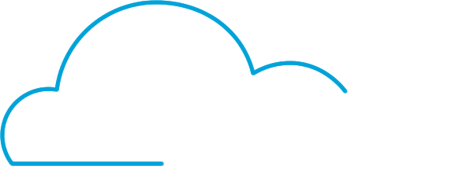

  
   

## Resources
> Links úteis relacionados à UI e UX

### Material Design
- [Guidelines](https://material.io/archive/guidelines/) (old)
- [Guidelines](https://material.io/design) (new)
- [Material Icons](https://material.io/icons/)
- [Material Web Components](https://material-components-web.appspot.com/) (old) 
- [Material Web Components](https://material-components.github.io/material-components-web-catalog) (new)
- [Materialize](http://materializecss.com/)
- [Google Design](https://medium.com/google-design)

## Design Sprint
> Toda a base necessária para aplicar uma Design Sprint

- [Apresentação](https://docs.google.com/presentation/d/1Ib0LFGxBQFqpaiOpzKZO5AuiE9JI92xLMs9uKQngK3o/edit?usp=sharing)
- [Design Sprint Kit](https://designsprintkit.withgoogle.com/)
- [Sprint Stories](https://sprintstories.com/)
- [Livro PDF](https://drive.google.com/open?id=1B9oAwwoHyfHPsjtIqwEgCDZStuNE5YTJ)

#### Como aplicar?
- [Preparando o terreno](./design-sprint/Preparando-o-terreno.md)
- [Material para o sprint](./design-sprint/Material-para-o-sprint.md)
- [Segunda](./design-sprint/sprint/1-Segunda.md)
- [Terça](./design-sprint/sprint/2-Terca.md)
- [Quarta](./design-sprint/sprint/3-Quarta.md)
- [Quinta](./design-sprint/sprint/4-Quinta.md)
- [Sexta](./design-sprint/sprint/5-Sexta.md)

## Tools
> Ferramentas para os processos de UI e UX

### Fluxogramas
- [Whimsical](https://whimsical.co) - Flowchart, Wireframes e Sticky Notes

### Wireframes
- [Balsamiq](https://balsamiq.com) - Ferramenta para sketch e wireframe

### Feedback
- [InvisionApp](http://invisionapp.com) - Plataforma para criar protótipos interativos, whiteboards e coletar feedback
- [Gallery](https://gallery.io) - Plataforma colaborativa para compartilhar e organizar protótipos
- [Red Pen](https://redpen.io) - Ferramenta para compartilhar protótipos e coletar feedback via comentários
- [UsabilityHub](https://usabilityhub.com) - Ferramenta para compartilhar e validar protótipos
- [Optimal Workshop](https://www.optimalworkshop.com) - Ferramenta para compartilhar e validar protótipos
- [Maze](https://maze.design) - Ferramenta para compartilhar e validar protótipos interativos do InvisionApp

### Cores
- [Material Palette Generator](https://material.io/design/color/the-color-system.html#tools-for-picking-colors) - Paleta de cores do Material Design 2018
- [Material Color Tool 2014](https://material.io/tools/color) - Paleta de cores do Material Design 2014
- [Color Contrast Checker](https://webaim.org/resources/contrastchecker/) - Verifica o constrate entre duas cores de acordo com o [WCAG 2.0](https://www.w3.org/TR/WCAG20/)
- [Adobe Color CC](https://color.adobe.com/pt/create/color-wheel/) - Cria combinações de cores e color schemes

### Outros
- [Dropmark](http://dropmark.com) - Organizador de links e imagens em coleções
- [Dummi](http://dummi.io/) - Gerador de dados fake
- [unDraw](https://undraw.co/illustrations) - Ilustrações (MIT licensed)
